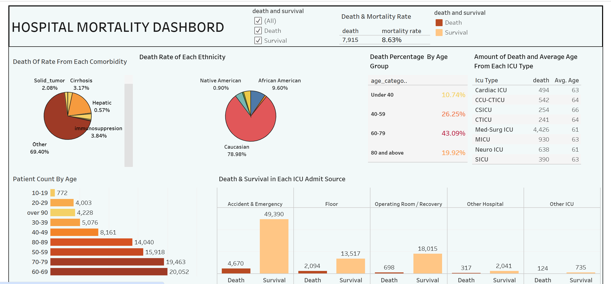

## **Business Problem**
Healthcare professionals aim to identify the primary causes of in-hospital mortality among admitted patients. By understanding these factors early, they can develop targeted interventions and implement evidence-based protocols to improve patient outcomes and reduce preventable deaths.

## **Approach**
To analyze in-hospital mortality, I conducted a comprehensive data-driven study using **SQL for data analysis** and **Tableau for visualization**. The approach involved the following steps:

1. **Data Acquisition & Cleaning**  
   - Imported the dataset into **Excel** for preliminary cleaning.  
   - Addressed missing values, duplicates, and inconsistencies.  
   - Imported the cleaned dataset into **MySQL** for analysis.  

2. **Exploratory Data Analysis (EDA) with SQL**  
   - Examined key patient attributes such as **age, ethnicity, gender, weight, BMI, heart rate, ICU admission details, and comorbidities**.  
   - Used SQL queries to identify **patterns, trends, and correlations** related to in-hospital mortality.  

3. **Visualization & Reporting in Tableau**  
   - Created an **interactive dashboard** summarizing key findings.  
   - Designed visual representations to highlight important mortality factors.  

---

## **Key Insights**

### **1. Overall Mortality Rate**
- Out of **10,000 admitted patients**, **7915 patients (8.63%)** died in the hospital.  
- This underscores the importance of identifying **predictive factors** to improve patient survival.

### **2. Age as a Major Predictor**
- Patients aged **60-79** had the **highest death percentage** relative to their group size.  
- Mortality rates **steadily increased** for patients aged **50-89**.  
- Patients aged **70-89 had nearly a 1 in 6 chance of dying** in the hospital.

### **3. ICU Admission & Type Analysis**
- Most patients were admitted to the ICU from **Accident & Emergency**, which also recorded the **highest number of deaths**.  
- However, the **highest probability of death** was among patients admitted from the **Floor (11.76%)**.  
- Among ICU types, **Med-Surg ICU** showed a significantly higher mortality rate than others.

### **4. Role of Physiological Factors**
- **Average weight** of deceased patients: **67.57 kg (149 lbs)**  
- **Average BMI**: **23.3 (normal range)**  
- **Average max heart rate**: **115.1 bpm**  
  - **High heart rates** are often linked to **cardiovascular distress or organ failure**, which may contribute to mortality.

### **5. Comorbidities & Mortality Risk**
- The dataset contained **8 comorbidities**, and the **top three with the highest mortality rates** were:  
  - **Diabetes** (highest mortality rate)  
  - **Immunosuppression**  
  - **Solid Tumor**  
- **Diabetes stood out with a mortality rate of 19.72%**, highlighting the need for **effective management of diabetic patients** in hospitals.

### **6. Length of ICU Stay & Mortality**
- Patients who stayed in the **ICU for more than a day had significantly higher mortality rates**.  
- Extended ICU stays may indicate **underlying severe conditions** or increased **risk of complications**.

---

## **Conclusion**
The analysis identified **age, comorbidities, heart rate, ICU admission type, and ICU length of stay** as the most significant predictors of in-hospital mortality. Key takeaways:

- **Age**: Nearly **20% of patients aged 70+** experienced in-hospital mortality.  
- **Comorbidities**: **Diabetes** was the **strongest predictor**, with a mortality rate of **24.45%**.  
- **Heart Rate**: The average **max heart rate of deceased patients was 115.1 bpm**, indicating potential cardiovascular instability.  
- **ICU Stay Duration**: Prolonged ICU stays were linked to **higher mortality rates**.

---

By expanding the dataset and refining predictive models, healthcare professionals can gain a **more comprehensive understanding** of in-hospital mortality factors, ultimately leading to **better patient care and intervention strategies**.

.png)
